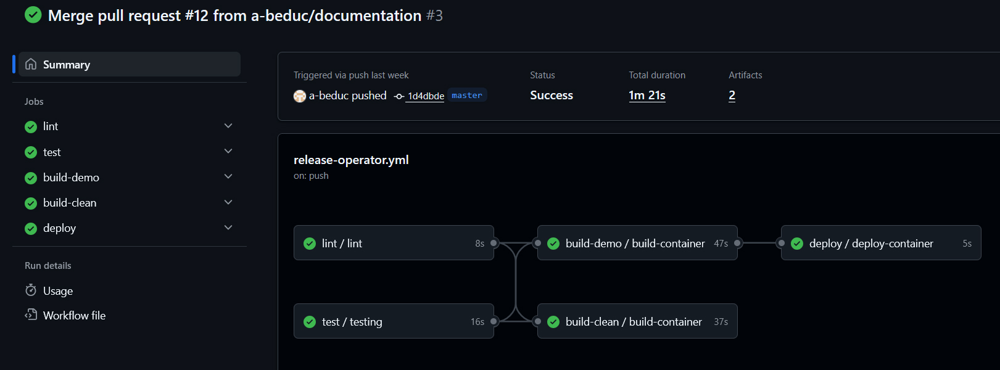

Deployment
==========

The application is deployed using:

+ **Docker Hub**: Two images are pushed (a clean image and a demo image).
+ **Render.com**: Deployment is performed directly using the latest Docker image.

CI/CD Pipeline
--------------

The GitHub Actions pipeline is composed of **three steps**:

#. **Linting and testing**
    + Linting with *Ruff*
    + Unit testing with *Pytest* (Minimum 80% coverage).
    + Executed on every push or pull request to the ``master`` branch.
    + If this step fails, the merge is rejected.

#. **Build and push images**
    + Build two docker images
    + Tag them with the commit SHA and "latest".
    + Push images to Docker Hub.

#. **Deployment**
    + Trigger a deployment on Render if build is successful.
    + Render pulls the ``latest`` image from DockerHub and redeploy.

   Example of a successful merge report.

Github environment variables
^^^^^^^^^^^^^^^^^^^^^^^^^^^^

Create a new GitHub **environment** named ``production``

Required **secrets**:

+ DJANGO_SECRET_KEY: Django signing key. `Django secret key generator <DJANGO_SECRET_KEY_>`_.
+ DJANGO_SENTRY_DSN: DSN provided by Sentry. `What is a DSN? <DJANGO_SENTRY_DSN_>`_
+ DOCKERHUB_TOKEN: Token used to give permission to action. `How to create one <DOCKERHUB_TOKEN_>`_.

Required **environment variables**:

+ DOCKERHUB_IMAGE_CLEAN: The name of the image (without demo data).
+ DOCKERHUB_IMAGE_DEMO: The name of the image (with demo data).
+ DOCKERHUB_REPO: The name of the docker repo (usually, DockerHub username).
+ DOCKERHUB_USERNAME: Dockerhub username (to login).
+ RENDER_DEPLOY_HOOK: Render endpoint to trigger redeploy. `What is a deploy hook? <RENDER_DEPLOY_HOOK_>`_.

Render
------

To set up the application on **Render**.

#. Create a **new Web Service**.
#. Choose **Deploy from image**.
#. Configure the environment variables required by Django.

+ DJANGO_ALLOWED_HOSTS: The hosts you want to use.
+ DJANGO_SECRET_KEY: Django signing key. Django secret key generator.
+ DJANGO_SENTRY_DSN: DSN provided by Sentry. `What is a DSN? <DJANGO_SENTRY_DSN_>`_

.. _DJANGO_SECRET_KEY: https://djecrety.ir/
.. _DJANGO_SENTRY_DSN: https://docs.sentry.io/concepts/key-terms/dsn-explainer/
.. _DOCKERHUB_TOKEN: https://docs.docker.com/security/access-tokens/#create-a-personal-access-token
.. _RENDER_DEPLOY_HOOK: https://render.com/docs/deploy-hooks
