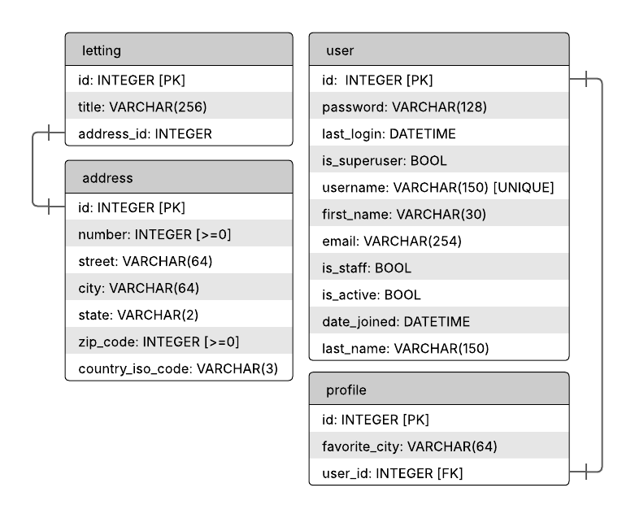

Technical specifications
========================

Language
--------

+ **Python** - Backend language.
+ **JavaScript** - Frontend interactivity.
+ **CSS** - Styling and layout.

Tools
-----

+ **Django** - Python web framework.
+ **Github actions** - CI/CD automation.
+ **Render** - Hosting for deployment.
+ **Sentry** - Error tracking monitoring.

Database
--------

+ **Sqlite3** - Lightweight database, for demo and development purposes.

Models
------

The models described in this section are the principals models used in the project.
They describe the structure of the database connected throught Django ORM.

+ Each ``Profile`` is linked to a Django ``User``.
+ Each ``Letting`` has a unique ``Address``.

Profiles
^^^^^^^^

The model ``profile`` is used to store additional informations linked to a user.

.. code-block:: python

    class Profile(models.Model):
        user = models.OneToOneField(User, on_delete=models.CASCADE)
        favorite_city = models.CharField(max_length=64, blank=True)

Letting
^^^^^^^

The model ``letting`` represent an available renting opportunity.
It is linked to one address.

.. code-block:: python

    class Letting(models.Model):
        title = models.CharField(max_length=256)
        address = models.OneToOneField(Address, on_delete=models.CASCADE)

Address
^^^^^^^

The model ``address`` is used to store informations about a location.

.. code-block:: python

    class Address(models.Model):
        number = models.PositiveIntegerField(validators=[MaxValueValidator(9999)])
        street = models.CharField(max_length=64)
        city = models.CharField(max_length=64)
        state = models.CharField(max_length=2, validators=[MinLengthValidator(2)])
        zip_code = models.PositiveIntegerField(validators=[MaxValueValidator(99999)])
        country_iso_code = models.CharField(max_length=3, validators=[MinLengthValidator(3)])

