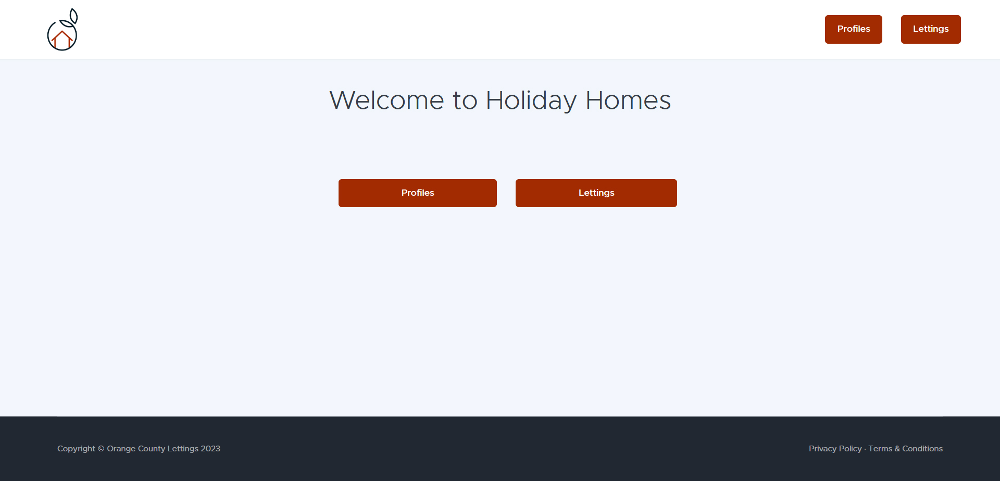
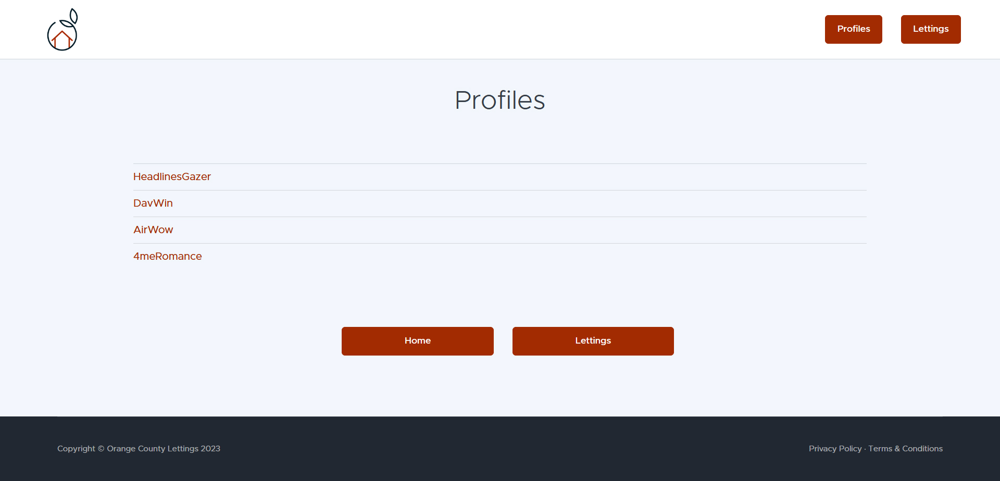
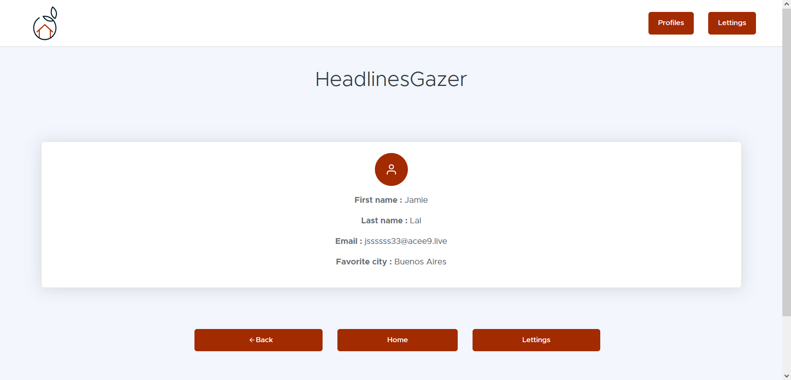
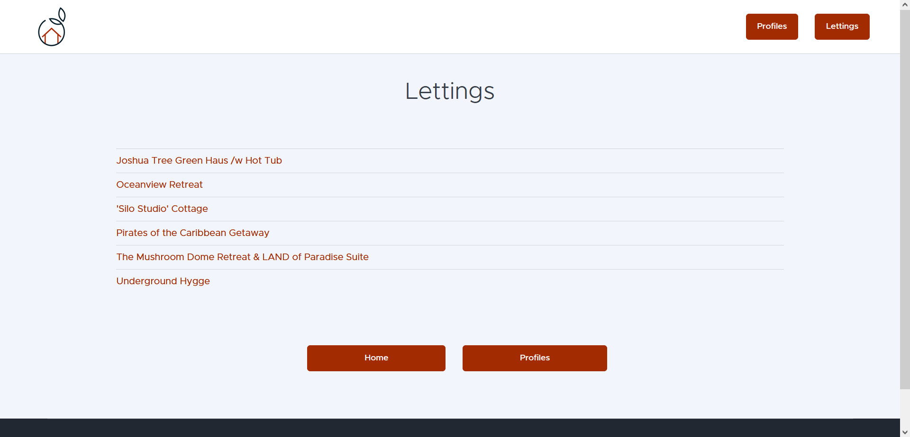
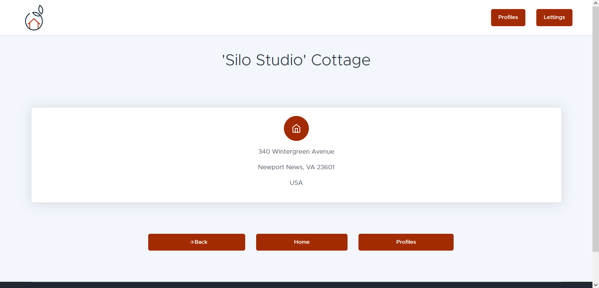
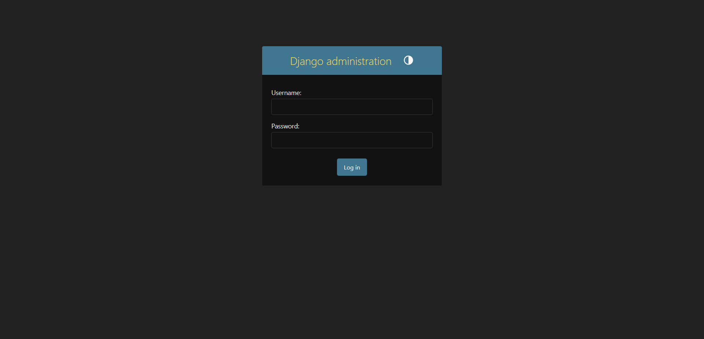
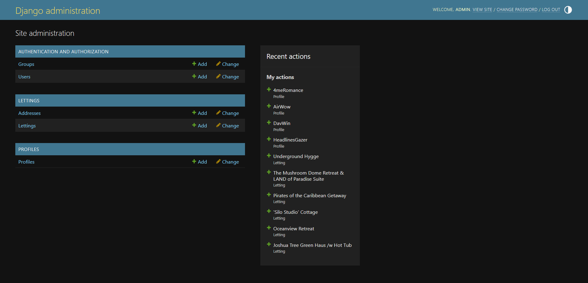
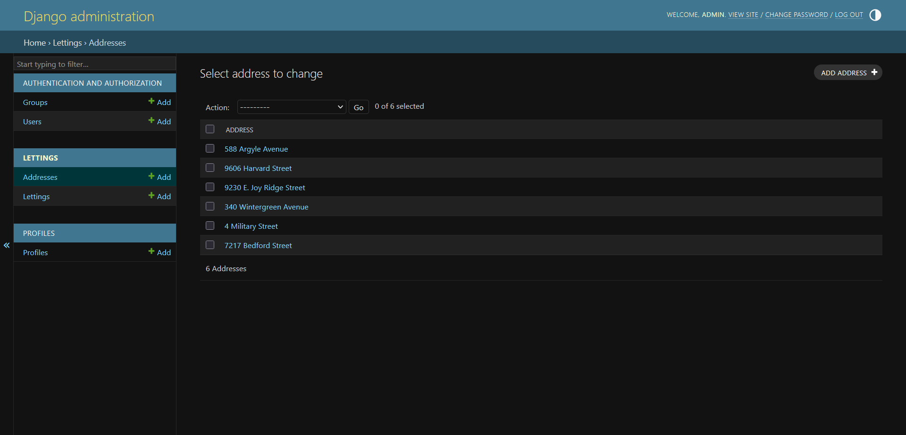

Usage
=====

This section provide examples of usage of the application, as a user or an
admin.

Site urls
---------

Once the applicatin is started or deployed, you can access the following
pages by adding to the public URL.

+ Index page: ``/``
+ Profiles page: ``/profiles/``
+ Profile detail page: ``/profiles/<id>/``
+ Lettings page: ``/lettings/``
+ Letting detail page: ``/lettings/<id>``

The admin panel can be accessed by adding ``/admin/`` to the public URL.

User
----
The following images show the pages a normal user can access.
Two buttons allows any user to consult the *Lettings* and the *Profiles*.

   This is the home page. Users can navigate to *Lettings* and *Profiles*.

Profile
^^^^^^^

The profile page allows to access profiles, you can check details of any
profile.

   Profile list page.

   Example of a profile details page.

Lettings
^^^^^^^^

The profile page allows to access profiles, you can check details of any
letting.

   Letting list page.

   Example of a letting details page.

Admin
-----

You can access the login panel by adding /admin/ to the url of the index.
By default, you can log in as an Admin with the username *admin* and the password
*Abc1234!*.

   Admin panel login page.

   Admin panel general view.

   Example of the admin panel for a ressource.
